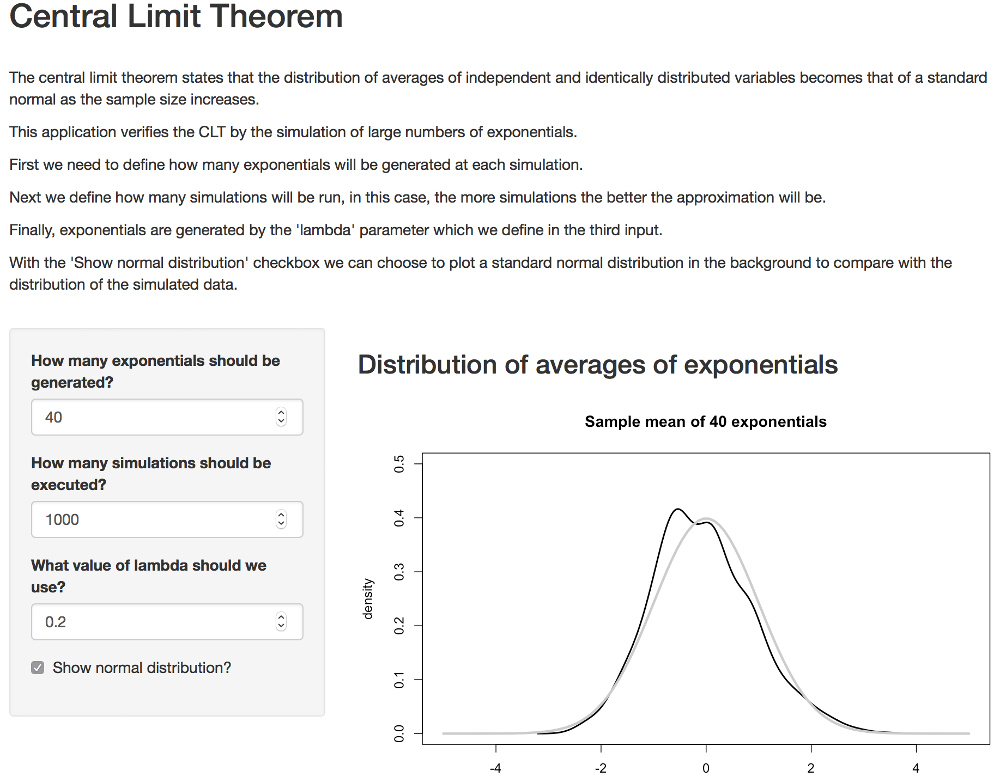

```{r setup, include=FALSE}
knitr::opts_chunk$set(echo = FALSE, message = FALSE)
```

## Central Limit Theorem

The central limit theorem states that the distribution of averages of independent and identically
distributed variables becomes that of a standard normal as the sample size increases.

- Let $X_1,\ldots,X_n$ be a collection of iid random variables with mean $\mu$ and variance $\sigma^2$
- Let $\bar X_n$ be their sample average
- Then $\frac{\bar X_n - \mu}{\sigma / \sqrt{n}}$ has a distribution like that of a standard normal for large $n$.
- Remember the form
$$\frac{\bar X_n - \mu}{\sigma / \sqrt{n}} = 
    \frac{\mbox{Estimate} - \mbox{Mean of estimate}}{\mbox{Std. Err. of estimate}}.
$$

## Example

- Verifying the CLT with the averages of large samples of exponentials.
- Simulation parameters:
```{r sim1, results = "hide", echo = TRUE}
    # number of simulations
    nSims <- 1000
    # number of exponentials
    nExp <- 40
    # lambda
    lambdaExp <- 0.2
    # mean of exponential distribution
    meanExp <- 1/lambdaExp
    # standard deviation
    sdExp <- 1/lambdaExp
```

- Executing the simulation
```{r sim2, echo = TRUE}
    expMeans <- matrix(rexp(nExp * nSims, rate = lambdaExp), ncol = nExp)
    expMeans <- apply(expMeans, 1, mean)
    expMeans <- (expMeans - meanExp) / (sdExp / sqrt(nExp))
    dty <- density(expMeans)
```

## Plotting the results
Applying the CLT to probe that the distribution of averages is normal.
```{r sim3, results = "asis", echo = TRUE, out.width = "500px"}
    plot(dty$x, dty$y, xlab = "", ylab = "density", type = "n", 
         xlim = c(-5, 5), ylim = c(0, .5))
    title(paste("Sample mean of", nExp, "observations"))
    lines(seq(-5, 5, length = 100), 
          dnorm(seq(-5, 5, length = 100)), col = grey(.8), lwd = 3)
    lines(dty$x, dty$y, lwd = 2)
```

## Conclusion

- The central limit theorem is right as the plot looks almost exactly like a standard bell curve.
- The shape has to be like that of a bell curve because we normalized the data when we subtracted off
the mean.
- Example shiny app that demonstrates de CLT:

```{r img, out.width = "500px"}

```
